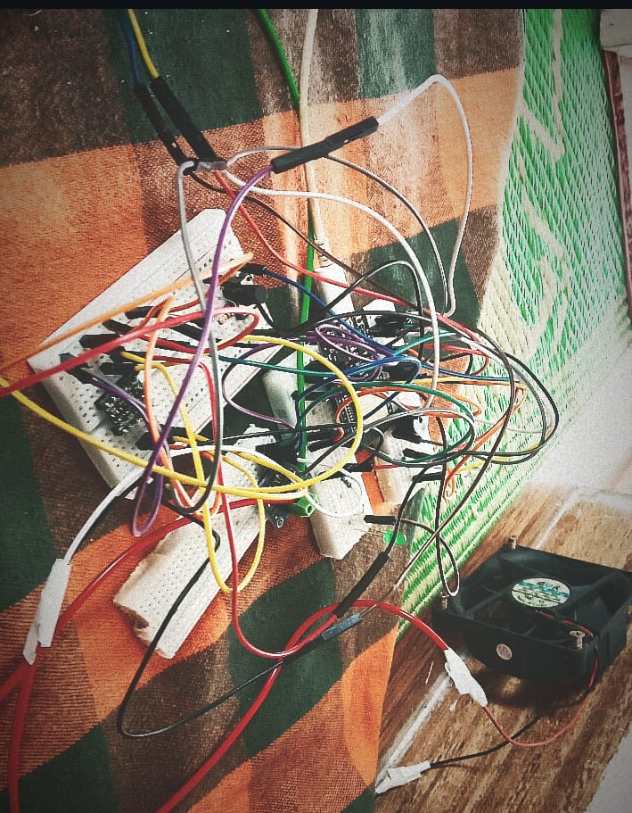
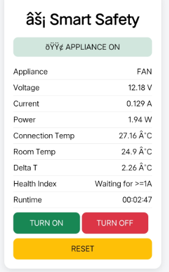

# Smart Electrical Safety Box ⚡

ESP32-based smart electrical safety and appliance monitoring prototype.

> Monitors connection health, measures current/temperature, controls the load remotely, and cuts power automatically when a fault is detected.

---

## Prototype Photos

| Breadboard Build | Web Dashboard |
|-----------------|---------------|
|  |  |

*12V prototype — tested and working. Dashboard shows live readings: 12.18V, 0.129A, ΔT 2.26°C, runtime 00:02:47*

---

## How It Works

```
12V Supply → INA219 → Relay → 12V Load (Fan)

NTC-1 → connection temperature
NTC-2 → room temperature reference
INA219 → voltage / current / power
ESP32  → processing + WiFi dashboard
Relay  → load ON/OFF control
```

### Health Index Formula

```
Health Index = ΔT ÷ I²

ΔT = NTC_connection − NTC_room
I  = load current (INA219)
```

A rising Health Index means the monitored connection is degrading — before it looks dangerous.

### Protection Logic

```
Normal:   sensors OK → relay ON → appliance runs
Fault:    temp > threshold → relay OFF → buzzer ON → red LED ON
Reset:    temp cools below reset threshold → manual button press → relay ON
```

Reset is refused while the connection is still hot.

---

## Hardware

| Component | Pin |
|-----------|-----|
| Green LED | GPIO 14 |
| Red LED | GPIO 27 |
| Buzzer | GPIO 25 |
| Reset Button | GPIO 32 |
| NTC-1 (connection) | GPIO 34 |
| NTC-2 (room) | GPIO 35 |
| Relay | GPIO 33 |
| INA219 SDA | GPIO 21 |
| INA219 SCL | GPIO 22 |

**Full component list:** [README hardware section in docs](docs/)

---

## Web Dashboard

ESP32 hosts a local web server (port 80). Connect your phone to the same WiFi — open the IP in browser.

**Dashboard shows:**
- 🟢 Appliance ON / 🔴 FAULT status
- Voltage, Current, Power
- Connection Temp, Room Temp, ΔT
- Health Index
- Runtime (HH:MM:SS)
- Remote ON / OFF / RESET buttons

---

## Firmware

| File | Description |
|------|-------------|
| [firmware/final_12v_prototype/](firmware/final_12v_prototype/final_12v_prototype.ino) | ✅ Full working firmware — NTC + INA219 + relay + WiFi dashboard |

**Before uploading firmware:**
```cpp
const char* ssid     = "YOUR_WIFI_NAME";
const char* password = "YOUR_WIFI_PASSWORD";
```
Replace with your actual WiFi credentials. Never commit real passwords.

**Libraries needed (Arduino Library Manager):**
- `Adafruit INA219`
- `Adafruit BusIO` (auto-installs with INA219)

---

## Build Stages

| Stage | What | Status |
|-------|------|--------|
| [Stage 1](docs/build-stages/stage-1-12v-prototype.md) | ESP32 + INA219 + relay + bulb | ✅ Complete |
| Stage 2 | NTC thermistors + ΔT | ✅ Complete |
| Stage 3 | Health index + WiFi dashboard | ✅ Complete |
| Stage 4 | Fault logic + auto cut-off + reset | ✅ Complete |
| Stage 5 | 230V mains version | 📋 Future — after full validation |

> 230V is Stage 5. Only after 12V prototype is fully validated.

---

## Completed Features

- [x] ESP32 setup and WiFi connection
- [x] INA219 voltage / current / power measurement
- [x] Two NTC thermistor temperature sensing
- [x] ΔT calculation (connection vs room)
- [x] Health Index computation (ΔT ÷ I²)
- [x] Relay control (active LOW)
- [x] Automatic fault detection + power cut
- [x] Buzzer + LED alerts
- [x] Manual reset with temperature lock
- [x] Local web dashboard (real-time, 1s refresh)
- [x] Remote appliance ON / OFF via browser
- [x] Runtime tracker (HH:MM:SS)

## Future Work

- [ ] Health Index trend logging (SD card or SPIFFS)
- [ ] Baseline learning mode
- [ ] Alert thresholds configurable via dashboard
- [ ] SMS / phone notification on fault
- [ ] Multi-appliance monitoring
- [ ] 230V mains version with proper safety design

---

## ⚠️ Safety Note

This is a **12V low-voltage prototype** for development and learning.

It is **not** a certified household electrical safety product.

The eventual 230V version requires proper electrical protection, isolation, certified enclosures, component ratings, and competent supervision.

---

By Maruthi R M — ECE Student, Malnad College of Engineering, Hassan, Karnataka
[RuralSense Labs](https://github.com/maruthirm333-prog/ruralsense-labs)
